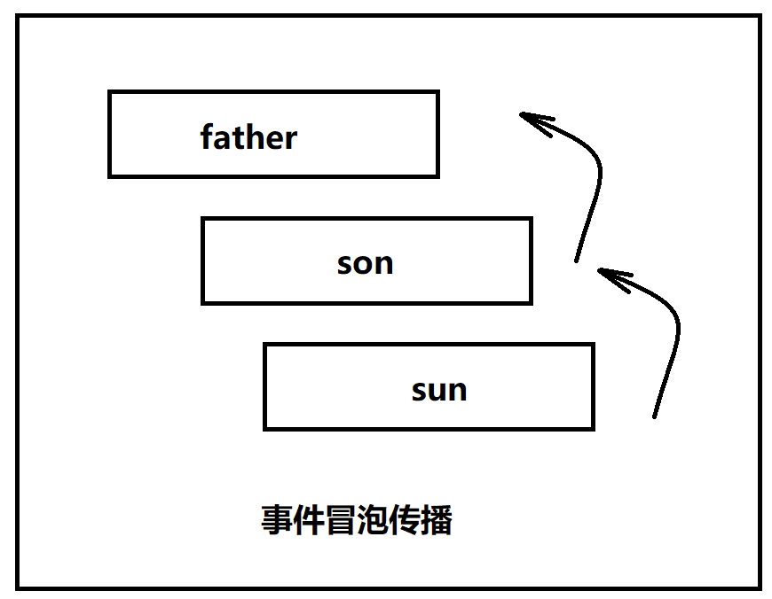
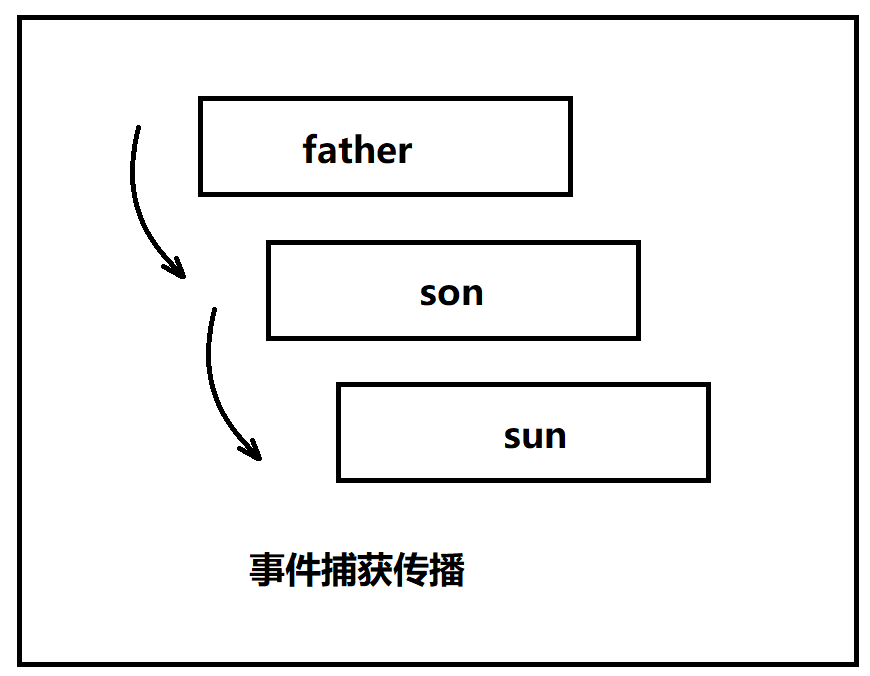
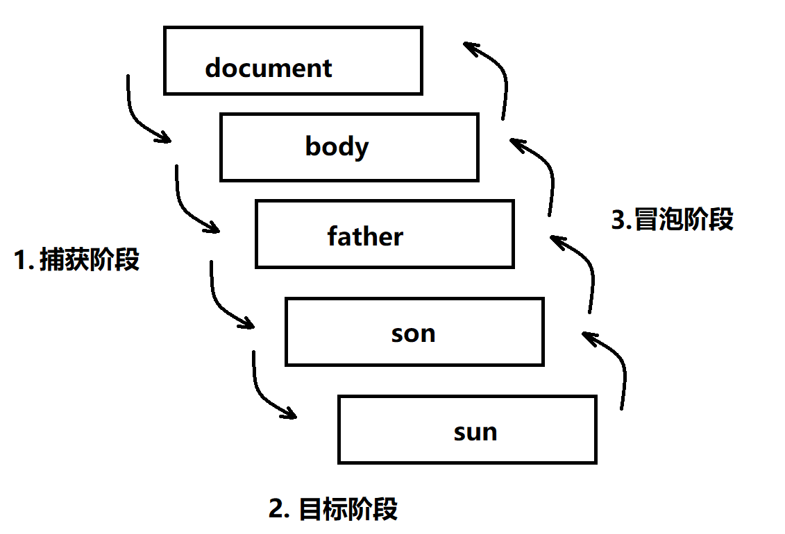

# 1. DOM 事件类

<!-- TOC -->

- [1. DOM 事件类](#1-dom-事件类)
  - [1.1. DOM 事件的级别](#11-dom-事件的级别)
    - [1.1.1. DOM 0 级事件](#111-dom-0-级事件)
      - [1.1.1.1. 定义事件处理程序](#1111-定义事件处理程序)
    - [1.1.2. DOM2 级事件](#112-dom2-级事件)
  - [1.2. DOM 事件模型](#12-dom-事件模型)
  - [1.3. DOM 事件流](#13-dom-事件流)
    - [1.3.1. 事件冒泡](#131-事件冒泡)
    - [1.3.2. 事件捕获](#132-事件捕获)
    - [1.3.3. DOM 事件流](#133-dom-事件流)
  - [1.4. event 对象](#14-event-对象)
    - [1.4.1. DOM 中的事件对象](#141-dom-中的事件对象)
    - [1.4.2. IE 中的事件对象](#142-ie-中的事件对象)
    - [1.4.3. 跨浏览器的事件对象](#143-跨浏览器的事件对象)
  - [1.5. 自定义事件](#15-自定义事件)

<!-- /TOC -->

## 1.1. DOM 事件的级别

### 1.1.1. DOM 0 级事件

> 通过 `JavaScript` 指定事件处理程序的传统方式，就是将一个函数赋值给一个事件处理程序属性。这种为事件处理程序赋值的方法是在第四代 Web 浏览器中出现的，而且至今仍然为所有现代浏览器所支持。原因一是简单，二是具有跨浏览器的优势。

#### 1.1.1.1. 定义事件处理程序

- 使用 JS 代码来给事件指定事件处理程序，方法是：将一个函数赋值给一个事件处理程序属性。
- 每个元素都有自己的事件处理程序属性，这些属性的名字与事件处理程序的名字相同，如 `onclick`。

```JavaScript
var btn = document.getElementById("myBtn");
//为按钮指定onclick事件处理程序
btn.onclick = function(){
    alert("Clicked");
}
```

**注意**：

- 使用 DOM0 级方法指定的事件处理程序被认为是元素的方法。因此，这时候的事件处理程序是在元素的作用域中运行；换句话说，程序中的 this 引用当前元素。
- 单击按钮显示的是元素的 ID，这个 ID 是通过 `this.id` 取得的。不仅仅是 ID，实际上可以在事件处理程序中通过 `this` 访问元素的任何属性和方法。以这种方式添加的事件处理程序会在事件流的冒泡阶段被处理

### 1.1.2. DOM2 级事件

“DOM2 级事件”定义了两个方法，用于处理指定和删除事件处理程序的操作：

- addEventListener(要处理的事件名，事件处理程序函数，布尔值)
  - 布尔值取值为 false：在冒泡阶段调用事件处理程序
  - 布尔值取值为 true：在捕获阶段调用事件处理程序
- removeEventListener(要处理的事件名，事件处理程序函数，布尔值)

大多数都是将事件处理程序添加到冒泡阶段，从而保证跨浏览器的兼容性，故通常都是将最后一个参数设为 false
所有的 DOM 节点都包含上述两个方法
DOM2 级添加的事件处理程序也是在其依附的元素的作用域中运行的
使用 DOM2 级方法可以为同一个元素添加多个事件处理程序，这些事件处理程序会按照添加它们的顺序从上到下执行（DOM0 级只能为同一个元素添加一个事件处理程序）

## 1.2. DOM 事件模型

## 1.3. DOM 事件流

DOM 事件流指从页面中接收事件的顺序，有冒泡流和捕获流。
　　当页面中发生某种事件（比如鼠标点击，鼠标滑过等）时，毫无疑问子元素和父元素都会接收到该事件，可具体顺序是怎样的呢？IE 和 Netscape 开发团队提出了几乎是完全相反的事件流概念。

### 1.3.1. 事件冒泡

> IE 的事件流叫做**事件冒泡**（event bubbling），即事件开始时由文档中嵌套层次最深的那个节点触发，然后逐级向上传播到其父元素依次被触发。



**拓展** : 阻止事件冒泡：`event.stopPropagation()`

```JavaScript
//1. 因为是事件的冒泡,因事件引起,也要因事件停止
father/son/sun.onclick = function (event) {

    //stop :停止  propagation：传播
    event.stopPropagation();
}

// onclick : 默认就是 第三个参数为 false:
 father.addEventListener('click',function(){
    alert('father');
  },false);
```

### 1.3.2. 事件捕获

> Netscape Communicator 团队提出的另一种事件流叫做**事件捕获**（event capturing），事件的处理将从 DOM 层次的根开始，而不是从触发事件的目标元素开始，事件被从目标元素的所有祖先元素依次往下传递。



```JavaScript
//当addEventListener第三个参数为true时，表示事件捕获
// 参数3 : 是否捕获
arr[i].addEventListener("click",function() {
    console.log(this);
  },true);
```

### 1.3.3. DOM 事件流

“DOM2 级事件”规定的时间流包括三个阶段：

1. 事件的捕获阶段
2. 事件的目标阶段（触发自己的事件）
3. 事件的冒泡阶段



- 若捕获事件和冒泡事件都存在，首先发生的是捕获阶段，然后是目标阶段，最后才是冒泡阶段。
- `addEventListener()` 第三个参数为是否捕获：
  - 如果为 `true` 时, 表示该事件在捕获阶段发生，
  - 如果为 `false` 时 , 表示该事件在冒泡阶段发生，

**兼容 ：** IE8 及更早版本不支持 DOM 事件流。

## 1.4. event 对象

### 1.4.1. DOM 中的事件对象

在触发 DOM 上的某个事件时，会产生一个事件对象 event，这个对象中包含着所有与事件有关的信息。包括导致事件的元素、事件的类型以及与特定事件相关的信息。鼠标事件触发时，事件对象中会包含鼠标的位置信息。键盘事件触发时，事件对象中会包含按下的键相关的信息。

现代浏览器获取 :

```JavaScript
// 给一个形参即可
btn.onclick = function(event){
//event 就是事件对象，里面包含了事件触发时的一些信息。
console.log(event);
}
```

低版本浏览器 (ie678):

```JavaScript
btn.onclick = function(){
//IE678 通过 window.event 获取事件对象
console.log(window.event);
}
```

兼容性 :

```JavaScript
btn.onclick = function(event){
//只要用到了事件对象，就要记得处理浏览器兼容性
event = event || window.event;
}
```

event 对象包含与创建它的特定事件有关的属性和方法。出发的事件类型不一样，可用的属性和方法也不一样。不过，所有事件都会有下表列出的成员。
| 属性/方法 | 类型 | 读/写 | 说明 |
| -------------------------- | -------- | ----- | ---------------------------------------------------------------------- |
| bubbles | Boolean | 只读 | 表明事件是否冒泡 |
| cancelable | Boolean | 只读 | 表明是否可以取消事件的默认行为 |
| currentTarget | Element | 只读 | 表明事件处理程序当前正在处理的元素 |
| defaultPervented | Boolean | 只读 | 为 true 表示已经调用了 preventDefault()方法 |
| detail | Integer | 只读 | 表示与事件相关的细节信息 |
| eventPhase | Integer | 只读 | 调用事件处理程序的阶段：1 表示捕获阶段，2 表示目标阶段，3 表示冒泡阶段 |
| preventDefault() | Function | 只读 | 取消事件的默认行为 |
| stopImmediatePropagation() | Function | 只读 | 取消事件的进一步捕获或冒泡，同时阻止任何事件处理程序被调用 |
| stopPropagation() | Function | 只读 | 阻止事件进一步捕获或冒泡 |
| target | Element | 只读 | 目标元素 |
| type | String | 只读 | 被触发的事件类型 |

---

### 1.4.2. IE 中的事件对象

| 属性/方法    | 类型    | 读/写 | 说明                                                                |
| ------------ | ------- | ----- | ------------------------------------------------------------------- |
| cancelBubble | Boolean | 读写  | 默认为 false。用于取消事件冒泡，与 DOM 中的 stopPropagation（）相同 |
| returnValue  | Boolean | 读写  | 默认为 true，用于取消默认行为，与 DOM 中的 preventDeafault（）相同  |
| srcElement   | Element | 只读  | 事件目标元素，与 DOM 中的 target 相同                               |
| type         | String  | 只读  | 被触发的事件类型                                                    |

### 1.4.3. 跨浏览器的事件对象

```JavaScript
var eventUtil = {
    addHandler: function(ele, type, handler) {
        // 代码在上文，
    },
    getEvent: function(event) {
        return event || window.event;
    },
    getTarget: function(event) {
        // 该语句可以不用，关键是传入的event是否已经被处理
        // var event = event || window.event;
        return event.target || event.srcElement;
    },
    preventDefault: function(event) {
        if(event.preventDefault) {
            event.preventDefault();
        } else {
            event.returnValue = false;
        }
    },
    removeHandler: function(ele, type, handler) {
        // 省略代码
    },
    stopPropagation: function(event) {
        if(event.stopPropagation) {
            event.stopPropagation(();
        } else {
            event.cancelBubble = true;
        }
    },
};
```

## 1.5. 自定义事件

自定义事件的写法

```JavaScript
//1、创建事件
var eve = new Event('custome');
//2、注册事件监听器
ev.addEventListener('custome', function() {
  console.log('custome');
});
//3、触发事件
ev.dispatchEvent(eve);
```
