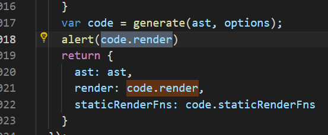
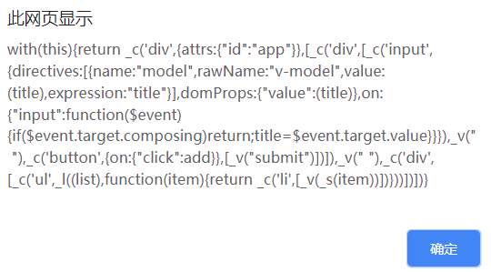

# 1. MVVM 和 Vue

> 如何理解 MVVM
> 如何实现 MVVM
> 是否解读过 vue 的源码

## 1.1. 说一下使用 jQuery 和使用框架的区别

### 1.1.1. jQuery 实现 todo-list

```html
<div>
  <input type="text" name="" id="txt-title" />
  <button id="btn-submit">submit</button>
</div>
<div><ul id="ul-list"></ul></div>

<script src="https://cdn.bootcss.com/jquery/3.2.1/jquery.min.js"></script>
<script type="text/javascript">
  var $txtTitle = $('#txt-title')
  var $btnSubmit = $('#btn-submit')
  var $ulList = $('#ul-list')
  $btnSubmit.click(function() {
    var title = $txtTitle.val()
    if (!title) {
      return
    }
    var $li = $('<li>' + title + '</li>')
    $ulList.append($li)
    $txtTitle.val('')
  })
</script>
```

### 1.1.2. vue 实现 todo-list

```html
<div id="app">
  <div><input v-model="title" /> <button v-on:click="add">submit</button></div>
  <div>
    <ul>
      <li v-for="item in list">{{item}}</li>
    </ul>
  </div>
</div>

<script type="text/javascript">
  // data 独立
  var data = {
    title: '',
    list: []
  }
  // 初始化 Vue 实例
  var vm = new Vue({
    el: '#app',
    data: data,
    methods: {
      add: function() {
        this.list.push(this.title)
        this.title = ''
      }
    }
  })
</script>
```

### 1.1.3. jQuery 和框架的区别

- 数据和视图的分离，解耦（开放封闭原则）

- 以数据驱动视图，只关心数据变化，DOM 操作被封装

## 1.2. 说一下对 MVVM 的理解

- MVVM - Model View ViewModel
- 三者之间的联系
- ViewModel 的理解，联系 View 和 Model

## 1.3. MVVM 框架的三大要素

- 响应式：vue 如何监听到 data 的每个属性变化？
- 模板引擎：vue 的模板如何被解析，指令如何处理？
- 渲染：vue 的模板如何被渲染成 html？以及渲染过程

## 1.4. vue 如何实现响应式

### 1.4.1. 什么是响应式

- 修改 data 属性之后，vue 立刻监听到，立刻做出修改
- data 属性被代理到 vm 上

```html
<div id="app">
  <p>{{name}}</p>
  <p>{{age}}</p>
</div>
<script src="https://unpkg.com/vue"></script>
<script type="text/javascript">
  var vm = new Vue({
    el: '#app',
    data: {
      name: 'zhangsan',
      age: 20
    }
  })
</script>
```

### 1.4.2. Object.defineProperty

```js
var obj = {}
var _name = 'shangsan'
Object.defineProperty(obj, 'name', {
    get: function () {
        console.log('get', _name) // 监听
        return _name
    },
    set: function (newVal) {
        console.log('set', newVal)  // 监听
        _name = newVal
    }
}
```

### 1.4.3. 模拟

```js
var vm = {}
var data = {
  name: 'zhangsan',
  age: 20
}
var key, value
for (key in data) {
  // 命中闭包。新建一个函数保证key的独立作用域
  ;(function(key) {
    Object.defineProperty(vm, key, {
      get: function() {
        console.log('get', data[key]) // 监听
        return data[key]
      },
      set: function(newVal) {
        console.log('set', newVal) // 监听
        data[key] = newVal
      }
    })
  })(key)
}
```

### 1.4.4. 问题解答

- 关键是理解 Object.defineProperty
- 将 data 的属性代理到 vm 上

## 1.5. vue 如何解析模板

### 1.5.1. 模板是什么

```js
<div id="app">
  <div>
    <input v-model="title">
    <button v-on:click="add">submit</button>
  </div>
  <ul>
    <li v-for="item in list">{{ item }}</li>
  </ul>
</div>
```

- 本质：对 vue 来说，模板本质就是一个字符串
- 有逻辑：如 v-if、v-for 等
- 与 html 格式很像，但有很大的区别
- 最终还要转换为 html 来显示
- 模板最终必须转换成 JS 代码，因为：
  - 有逻辑，必须用 JS 才能实现（图灵完备，判断循环递归等）
  - 转换为 html 渲染页面，必须用 JS 才能实现
  - 因此，模板最重要转换成一个 JS 函数（render 函数）

### 1.5.2. render 函数

```js
;<div id="app">
  <p>{{ price }}</p>
</div>

with (this) {
  return _c(
    'div',
    {
      attrs: { id: 'app' }
    },
    [_c('p', [_v(_s(price))])]
  )
}
```

- 模板中所有的信息都包含在 render 函数中
- this 即 vm
- price 即 this.price 即 vm.price，即 data 中的 price
- \_c 即 this.\_c 即 vm.c

```html
<div id="app"><p>{{price}}</p></div>

<script>
  var vm = new Vue({
    el: '#app',
    data: {
      price: 100
    }
  })

  // 手写 render 函数
  function render() {
    with (this) {
      // this 就是 vm
      return _c(
        'div',
        {
          attrs: {
            id: 'app'
          }
        },
        [_c('p', [_v(_s(price))])]
      )
    }
  }

  // 相当于
  function render1() {
    return vm._c(
      'div',
      {
        attrs: {
          id: 'app'
        }
      },
      [vm._c('p', [vm._v(vm._s(vm.price))])]
    )
  }
</script>
```

- 从哪里可以看到 render 函数？
- 复杂一点的例子，render 函数是什么样子的？
- v-if v-for v-on 都是怎么处理的？

```html
<div id="app">
  <div><input v-model="title" /> <button v-on:click="add">submit</button></div>
  <div>
    <ul>
      <li v-for="item in list">{{item}}</li>
    </ul>
  </div>
</div>
```

在 vue 源码中搜索`code.render`，然后加上`alert(code.render)`



复制浏览器中弹出的代码



vue2.0 开始支持预编译，在开发环境下写模板经过编译打包之后放在生产环境下是 JS 代码

```js
with (this) {
  // this 就是 vm
  return _c(
    'div',
    {
      attrs: {
        id: 'app'
      }
    },
    [
      _c('div', [
        _c('input', {
          directives: [
            {
              name: 'model',
              rawName: 'v-model',
              value: title,
              expression: 'title'
            }
          ],
          domProps: {
            value: title
          },
          on: {
            input: function($event) {
              if ($event.target.composing) return
              title = $event.target.value
            }
          }
        }),
        _v(' '),
        _c(
          'button',
          {
            on: {
              click: add
            }
          },
          [_v('submit')]
        )
      ]),
      _v(' '),
      _c('div', [
        _c(
          'ul',
          _l(list, function(item) {
            return _c('li', [_v(_s(item))])
          })
        )
      ])
    ]
  )
}
```

- 根据 todo-list demo 的 render 函数：
  - v-model 是怎么实现的？
    - 一个 get 一个 set
  - v-on:click 怎么实现？
    - 渲染 button 的时候绑定上 click 事件，定义 add 函数
  - v-for 怎么实现的？
    - list 数组遍历，每个元素封装成 li 标签汇成一个数组，一起返回作为 ul 标签的子元素

### 1.5.3. render 函数与 vdom

```js
// render函数
with (this) {
  return _c(
    'div',
    {
      attrs: { id: 'app' }
    },
    [_c('p', [_v(_s(price))])]
  )
}

// snabbdom中的h函数
var vnode = h('div#container.two.classer', { on: { click: someFn } }, [
  h('span', { style: { fontWeight: 'bold' } }, 'This is bold'),
  'and this is just normal text',
  h('a', { props: { href: '/foo' } }, "I'll take you places!")
])
```

- vm.\_c 其实就相当于 snabbdom 中的 h 函数
- render 函数执行之后，返回的是 vnode

```js
vm._update(vnode) {
  const prevVnode = vm._vnode
  vm._vnode = vnode
  if (!prevVnode) {
    vm.$el = vm.__patch__(vm.$el, vnode)
  } else {
    vm.$el = vm.__patch__(prevVnode, vnode)
  }
}

function updateComponent() {
  // vm._redner即上面的render函数，返回vnode
  vm._update(vm._render())
}
```

- updateComponent 中实现了 vdom 中的 patch
- 页面首次渲染执行 updateComponent
- data 中每次修改属性,执行 updateComponent

### 1.5.4. 问题解答

- 模板：本质字符串，有逻辑，嵌入 JS 变量
- 模板必须转换为 JS 代码
- render 函数
- render 函数执行是返回 vnode
- updateComponent

## 1.6. vue 的整个实现流程

> vue 整个的实现流程是怎么样的？

### 1.6.1. 第一步：解析模板成 render 函数

- with 的用法
- 模板中的所有信息都被 render 函数包含
- 模板中用到的 data 中的属性，都变成了 JS 变量
- 模板中的 v-model v-for v-on 都变成了 JS 逻辑
- render 函数返回 vnode

```js
<div id="app">
  <div>
    <input v-model="title" /> <button v-on:click="add">submit</button>
  </div>
  <div>
    <ul>
      <li v-for="item in list">{{ item }}</li>
    </ul>
  </div>
</div>
```

### 1.6.2. 第二步：响应式开始监听

- Object.defineProperty
- 将 data 的属性代理到了 vm 上

### 1.6.3. 第三步：首次渲染，显示页面，绑定依赖

- 初次渲染，执行 updateComponent，执行 vm.\_render()
- 执行 render()函数，会访问到 vm.list 和 vm.title
- 会被响应式的 get 方法监听到
- 执行 updateComponent，会走到 vdom 的 patch 方法
- patch 将 vnode 渲染成 DOM，初次渲染完成

```js
vm._update(vnode) {
  const prevVnode = vm._vnode
  vm._vnode = vnode
  if (!prevVnode) {
    vm.$el = vm.__patch__(vm.$el, vnode)
  } else {
    vm.$el = vm.__patch__(prevVnode, vnode)
  }
}

function updateComponent() {
  // vm._redner即上面的render函数，返回vnode
  vm._update(vm._render())
}
```

> 为什么要监听 get，直接监听 set 不行吗？

- data 中有很多属性，有些被用到，有些可能不被用到
- 被用到的会走到 get，不被用到的不会走到 get
- 未走到 get 中的属性，set 的时候我们也无需关心
- 避免不必要的重复渲染

### 1.6.4. 第四步：data 属性变化，触发 rerender 函数

- 修改属性，被响应式的 set 监听到
- set 中执行 updateComponent
- updateComponent 重新执行 vm.\_render()
- 生成 vnode 和 prevVnode，通过 patch 进行对比
- 渲染到 HTML 中

### 1.6.5. 问题解答

- 第一步：解析模板成 render 函数
- 第二步：响应式开始监听
- 第三步：首次渲染，显示页面，绑定依赖
- 第四步：data 属性变化，触发 rerender 函数

## 1.7. 总结

1. 说一下使用 jQuery 和使用框架的区别

   - 数据和视图的分离，解耦
   - 以数据驱动视图，只关心数据变化，DOM 操作被封装

2. 什么是 MVVM

   - MVVM ：Model View VIewModel
   - 三者之间的联系，以及如何对应到各段代码
   - ViewModel 的理解，联系 View 和 Model

3. MVVM 的三要素

   - 响应式：vue 如何监听到 data 的每个属性变化？
   - 模板引擎：vue 的模板如何被解析，指令如何处理？
   - 渲染：vue 的模板如何被渲染成 html？以及渲染过程

4. Vue 如何实现响应式

   - 关键是理解 Object.defineProperty
   - 将 data 的属性代理到 vm 上

5. vue 如何解析模板

   - 模板：本质字符串，有逻辑，嵌入 JS 变量
   - 模板必须转换为 JS 代码（图灵完备语言，有逻辑、渲染 html、JS 变量）
   - render 函数是什么样子的
   - render 函数执行是返回 vnode
   - updateComponent

6. vue 实现的整体流程

   - 第一步：解析模板成 render 函数
   - 第二步：响应式开始监听
   - 第三步：首次渲染，显示页面，绑定依赖
   - 第四步：data 属性变化，触发 rerender 函数
