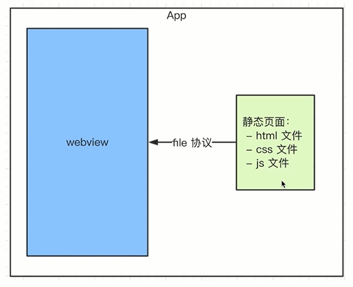
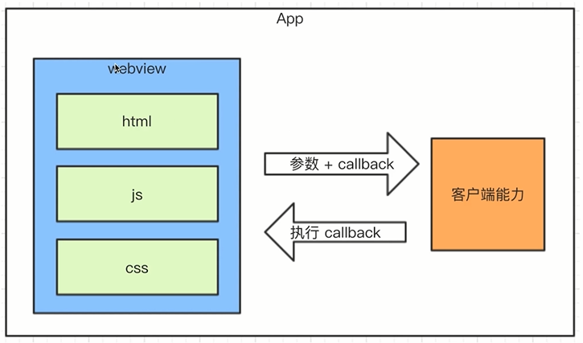

# 1. hybrid

> - 移动端占大部分流量，已经远超过 PC
> - 一线互联网公司都有自己的 App
> - 这些 App 中有很大比例的前端代码
> - 拿微信举例，你每天浏览微信的内容，多少是前端？

## 1.1. hybrid 是什么？为何用 hybrid？

- hybrid 是客户端和前端的混合开发
- hybrid 存在的核心意义在于快速迭代，无需审核

### 1.1.1. hybrid 文字解释

- hybrid 即“混合”，即前端和客户端的混合开发
- 需前端开发人员和客户端开发人员配合完成
- 某些环节也可能涉及到 server 端
- 不要以为自己是前端就可以不理会客户端的知识

### 1.1.2. 存在价值，为何会用 hybrid

- 可以快速迭代更新，无需 App 审核（关键）
  - app 的代码有权利访问到手机的地理位置声音视频等 api，用这些功能开发的 app 肯定需要严格审核
  - hybrid 的代码是纯前端开发的，无需这种审核机制
- 体验流畅（和 NA 的体验基本一致）
- 减少开发和沟通成本，双端公用一套代码

### 1.1.3. webview

- 是 app 中的一个组件（app 中可以有 webview，也可以没有）
- 用于加载 h5 页面，即一个小型的浏览器内核

### 1.1.4. file：//协议

- 其实在一开始接触 html 开发，就已经使用了 file 协议
- 只不过你当时没有“协议”、“标准”等这些概念
- 再次强调“协议”、“标准”的重要性

http 协议和 file 协议的区别

- file 协议：本地文件，快
- http 协议：网络加载，慢

### 1.1.5. hybrid 实现流程

- 不是所有场景都适合使用 hybrid
- 使用 NA：体验要求极致，变化不频繁（头条首页）
- 使用 hybrid：体验要求高，变化频繁（头条的新闻详情页）
- 使用 h5：体验无要求，不常用（举报、反馈等页面）


具体流程图

- 前端做好静态页面（html js css），将文件交给客户端
- 客户端拿到前端静态页面，以文件形式存储在 app 中
- 客户端在一个 webview 中
- 使用 file 协议加载静态页面

## 1.2. 介绍一下 hybrid 更新和上线的流程？

- 服务端的版本和 zip 包维护
- 更新 zip 包之前，先对比版本号
- zip 下载解压和覆盖

### 1.2.1. 目的，可行途径

- 要替换每个客户端的静态文件
- 只能客户端来做（客户端是我们开发的）
- app 去 server 端下载最新的静态文件
- 我们维护 server 的静态文件

### 1.2.2. 完整流程

- 分版本，有版本号，如 201803211015
- 将静态文件压缩成 zip 包，上传到服务端
- 客户端每次启动，都去服务端检查版本号
- 如果服务端版本号大于客户端版本号，就去下载最新的 zip 包
- 下载完之后解压包，然后将现有文件覆盖

## 1.3. hybrid 和 h5 的主要区别

### 1.3.1. 优点

- 体验更好，跟 NA 体验基本一致
- 可快速迭代，无需 app 审核

### 1.3.2. 缺点

- 开发成本高。联调、测试、查 bug 都比较麻烦
- 运维成本高，上线很麻烦

### 1.3.3. 适用的场景

- hybrid：产品型，产品的稳定功能，体验要求高，迭代频繁
- h5：运营型，单次的运营活动（红包）或不常用的功能

## 1.4. 前端 JS 和客户端如何通讯？

- 通讯的基本形式：调用能力、传递参数、监听回调
- 对 schema 协议的理解和使用
- 调用 schema 代码的封装
- 内置上线的好处：更快，更安全

### 1.4.1. 新闻详情页适用 hybrid，前端如何获取新闻内容？

- 不能用 ajax。跨域问题，速度慢
- 客户端获取新闻内容，然后 JS 通讯拿到内容，再渲染

### 1.4.2. JS 和客户端通讯的基本形式



- JS 访问客户端能力，传递参数和回调函数
- 客户端通过回调函数返回内容

### 1.4.3. schema 协议简介和使用

- 之前介绍了 http 和 file 协议
- schema 协议 —— 前端和客户端通讯的约定

微信的部分 schema 协议

```schema
weixin://dl/scan      扫一扫
weixin://dl/feedback  反馈
weixin://dl/moments   朋友圈
weixin://dl/settings  设置
```

```js
function invokeScan() {
  window['_invoke_scan_callback_'] = function(result) {
    alert(result)
  }

  var iframe = document.createElement('iframe')
  iframe.style.display = 'none'
  // iframe.src = 'weixin://dl/scan'  // 重要！
  iframe.src =
    'weixin://dl/scan?k1=v1&k2=v2&k3=v3&callback=_invoke_scan_callback_'
  var body = document.body
  body.appendChild(iframe)
  setTimeout(function() {
    body.removeChild(iframe)
    iframe = null
  })
}
```

### 1.4.4. schema 使用的封装

```js
// 封装效果，傻瓜式调用，而且不用再自己定义全局函数
window.invoke.share(
  {
    title: 'xxx',
    content: 'yyy'
  },
  function(result) {
    if (result.errno === 0) {
      alert('分享成功')
    } else {
      alert(result.message)
    }
  }
)
```

schema 封装

```js
;(function(window, undefined) {
  // 调用 schema 的封装
  function _invoke(action, data, callback) {
    // 拼装 schema 协议
    var schema = 'myapp://utils/' + action

    // 拼接参数
    schema += '?a=a'
    var key
    for (key in data) {
      if (data.hasOwnProperty(key)) {
        schema += '&' + key + data[key]
      }
    }

    // 处理 callback
    var callbackName = ''
    if (typeof callback === 'string') {
      callbackName = callback
    } else {
      callbackName = action + Date.now()
      window[callbackName] = callback
    }
    schema += 'callback=callbackName'

    // 触发
    var iframe = document.createElement('iframe')
    iframe.style.display = 'none'
    iframe.src = schema // 重要！
    var body = document.body
    body.appendChild(iframe)
    setTimeout(function() {
      body.removeChild(iframe)
      iframe = null
    })
  }

  // 暴露到全局变量
  window.invoke = {
    share: function(data, callback) {
      _invoke('share', data, callback)
    },
    scan: function(data, callback) {
      _invoke('scan', data, callback)
    },
    login: function(data, callback) {
      _invoke('login', data, callback)
    }
  }
})(window)
```

### 1.4.5. 内置上线

- 将以上封装的代码打包，叫做 invoke.js，内置到客户端
- 客户端每次启动 webview，都默认执行 invoke.js
- 本地加载，免去网络加载的时间，更快
- 本地加载，没有网络请求，黑客看不到 schema 协议，更安全
